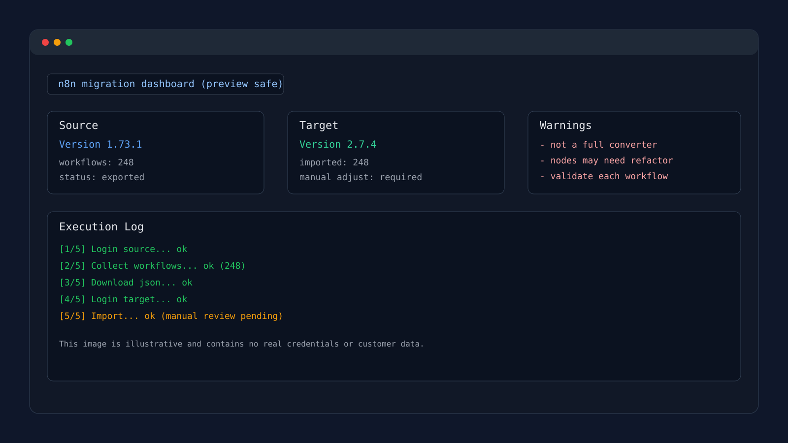

<h1 align="center">
  
  <br />
  Download Workflows N8N
</h1>

<p align="center">
  
  
  
  
  
  
</p>

<p align="center">
  Automação para exportar e importar workflows entre ambientes n8n, com foco em migração entre versões.
</p>

<p align="center">
  
</p>

---

## 📚 Sobre o projeto

Este projeto automatiza o processo operacional de migração de workflows n8n via interface web (UI), usando **Playwright + TypeScript**.

O cenário de uso principal foi:

- **origem:** `Version 1.73.1`
- **destino:** `Version 2.7.4`

A automação cobre exportação em massa, classificação por pasta e importação no ambiente destino.

| Etapa                   | Onde                      | Como                                                           |
| ----------------------- | ------------------------- | -------------------------------------------------------------- |
| **Autenticação**        | n8n origem/destino        | Login por UI com sessão persistida (`launchPersistentContext`) |
| **Coleta de workflows** | Lista virtualizada do n8n | Scroll incremental com deduplicação por ID                     |
| **Download em lote**    | Página de cada workflow   | Ação de menu "Download" com retry automático                   |
| **Importação em lote**  | Projeto/pastas no destino | Upload do JSON e criação/seleção de pastas por regras          |
| **Resumo final**        | Terminal                  | Estatísticas de sucesso/falha por workflow                     |

## ⚠️ Ênfase importante sobre a migração (1.73.1 -> 2.7.4)

- Este código foi feito para **migrar workflows automaticamente** da versão `1.73.1` para `2.7.4`.
- Os workflows baixados **não estão prontos automaticamente** para atender todas as atualizações da versão `2.7.4`.
- O processo de **adaptação funcional dos workflows foi manual** dentro do n8n.
- Esta interface é um código de automação para **export/import** e apoio operacional de migração, não um conversor completo de compatibilidade entre versões.

## 💻 Pré-requisitos

É necessário ter instalado na sua máquina:

- [Git](https://git-scm.com)
- [Node.js](https://nodejs.org/) (`v22.12.0` — veja `.nvmrc`)
- npm
- Acesso aos ambientes n8n de origem e destino

## 🚀 Como executar o projeto

```bash
# Clone este repositório
$ git clone https://github.com/VitorFirmino/downloadWorkflowsN8n.git

# Acesse a pasta do projeto
$ cd downloadWorkflowsN8n

# Instale as dependências
$ npm install

# Instale o browser do Playwright
$ npm run install:browsers

# Copie as variáveis de ambiente
$ cp .env.example .env
```

Depois de copiar o `.env`, configure as variáveis necessárias para origem e destino.
Veja a tabela completa em **⚙️ Variáveis de ambiente** e o arquivo [`.env.example`](.env.example).

```bash
# Desenvolvimento (watch)
$ npm run dev

# Build + execução
$ npm start

# Apenas compilar
$ npm run build
```

## 🔄 Modos de operação

| Modo                | Como usar                            | Resultado                                         |
| ------------------- | ------------------------------------ | ------------------------------------------------- |
| **Export + Import** | Configure origem e destino no `.env` | Baixa e importa os workflows                      |
| **Import Only**     | `N8N_IMPORT_ONLY=true`               | Importa apenas arquivos já salvos em `EXPORT_DIR` |

## 🧠 Conceitos aplicados

- **Sessão persistida Playwright** — reaproveita login entre execuções
- **Coleta robusta de lista virtualizada** — scroll por rounds com progresso em tempo real
- **Download resiliente** — retry por workflow e continuidade em caso de erro
- **Importação guiada por regras** — mapeamento de pastas via regex (`N8N_RULES_PATH`)
- **Fallback de pasta** — usa `N8N_FALLBACK_FOLDER` quando não há correspondência
- **Auto-detecção de projeto** — resolve `projectId` quando não informado

## ⚙️ Variáveis de ambiente

| Variável                        | Descrição                               | Padrão                    |
| ------------------------------- | --------------------------------------- | ------------------------- |
| `N8N_BASE_URL`                  | URL base do n8n de origem               | obrigatório               |
| `N8N_EMAIL`                     | Email da origem                         | obrigatório               |
| `N8N_PASSWORD`                  | Senha da origem                         | obrigatório               |
| `N8N_BASE_URL_TARGET`           | URL base do n8n de destino              | opcional                  |
| `N8N_EMAIL_TARGET`              | Email do destino                        | opcional                  |
| `N8N_PASSWORD_TARGET`           | Senha do destino                        | opcional                  |
| `N8N_PROJECT_ID_TARGET`         | Project ID do destino                   | opcional (auto-detecção)  |
| `N8N_RULES_PATH`                | Caminho do JSON de regras de pastas     | opcional                  |
| `N8N_FALLBACK_FOLDER`           | Pasta fallback para workflows sem regra | `Externo`                 |
| `N8N_IMPORT_ONLY`               | Executa só a importação                 | `false`                   |
| `EXPORT_DIR`                    | Diretório de exportação                 | `exports`                 |
| `PLAYWRIGHT_SESSION_DIR`        | Sessão da origem                        | `.playwright-session`     |
| `PLAYWRIGHT_SESSION_DIR_TARGET` | Sessão do destino                       | `.playwright-session-new` |
| `SCROLL_TIMEOUT`                | Timeout de coleta (ms)                  | `60000`                   |
| `PAGE_TIMEOUT`                  | Timeout de navegação/interação (ms)     | `60000`                   |
| `HEADLESS`                      | Executar sem janela (`true`/`false`)    | `false`                   |

## 📦 Saída dos arquivos

Os workflows exportados são salvos em `./exports` (ou no caminho definido em `EXPORT_DIR`) no formato:

```txt
{nome-do-workflow-slug}__{id-do-workflow}.json
```

Exemplo:

```txt
pedido-aprovado-financeiro__abc123.json
```

## 🧭 Fluxo de migração

1. Faz login no n8n de origem (ou reaproveita sessão válida).
2. Coleta todos os workflows da lista virtualizada.
3. Abre cada workflow e executa download do JSON.
4. Faz login no n8n de destino.
5. Detecta o projeto alvo (`N8N_PROJECT_ID_TARGET` ou auto).
6. Classifica o arquivo por pasta com regras regex.
7. Cria pastas ausentes quando necessário.
8. Importa os workflows um a um e segue para o próximo em caso de falha.

## 🧩 Regras de pasta (import)

Você pode usar um arquivo JSON para direcionar cada workflow para uma pasta específica no destino.

Exemplo (`folder-rules.json`):

```json
[
  { "folderPath": "Financeiro", "pattern": "boleto|pix|invoice", "flags": "i" },
  {
    "folderPath": "Logistica",
    "pattern": "frete|shipping|delivery",
    "flags": "i"
  },
  {
    "folderPath": "Atendimento",
    "pattern": "ticket|suporte|whatsapp",
    "flags": "i"
  }
]
```

## 📁 Estrutura do projeto

```txt
src/
├── index.ts                                  # Orquestração principal (export/import)
├── config.ts                                 # Leitura e validação de env vars
├── logger.ts                                 # Logs, progresso e resumo final
├── domain/
│   ├── types.ts                              # Tipos de domínio e contratos
│   └── errors.ts                             # Erros customizados
├── application/use-cases/
│   ├── login.use-case.ts                     # Login no n8n
│   ├── collect-workflows.use-case.ts         # Coleta da lista virtualizada
│   ├── download-workflow.use-case.ts         # Download individual com retry
│   ├── download-all-workflows.use-case.ts    # Download em lote + deduplicação
│   └── import-workflows.use-case.ts          # Importação, pastas e regras
└── infrastructure/
    ├── auth/session-manager.ts               # Sessão persistida e validação
    ├── browser/playwright-browser.service.ts # Abstrações de interação Playwright
    ├── filesystem/file-system.service.ts     # Utilidades de arquivo
    ├── n8n/n8n-selectors.ts                  # Seletores de UI do n8n
    ├── ui/terminal-ui.ts                     # UI de progresso no terminal
    └── utils/delay.ts                        # Delay utilitário
```

## 🔧 Scripts

| Comando                    | Descrição                                 |
| -------------------------- | ----------------------------------------- |
| `npm run dev`              | Executa em modo desenvolvimento com watch |
| `npm run build`            | Compila TypeScript para `dist/`           |
| `npm start`                | Faz build e executa em modo produção      |
| `npm run install:browsers` | Instala Chromium para Playwright          |

## 🛠️ Tecnologias

- [Node.js](https://nodejs.org/)
- [TypeScript](https://www.typescriptlang.org/)
- [Playwright](https://playwright.dev/)
- [dotenv](https://www.npmjs.com/package/dotenv)

## 🐛 Troubleshooting

- **Falha de login:** valide credenciais e URL no `.env`.
- **Timeout de interação:** aumente `PAGE_TIMEOUT` e `SCROLL_TIMEOUT`.
- **Download não inicia:** reinstale browser com `npm run install:browsers`.
- **Import em pasta errada:** revise regex no `N8N_RULES_PATH`.
- **Mudança visual no n8n:** atualize seletores em `src/infrastructure/n8n/n8n-selectors.ts`.

## 📝 Licença

Este projeto está sob a licença MIT. Veja o arquivo [LICENSE](LICENSE) para mais detalhes.

---

Feito por [Vitor Firmino](https://github.com/VitorFirmino)
